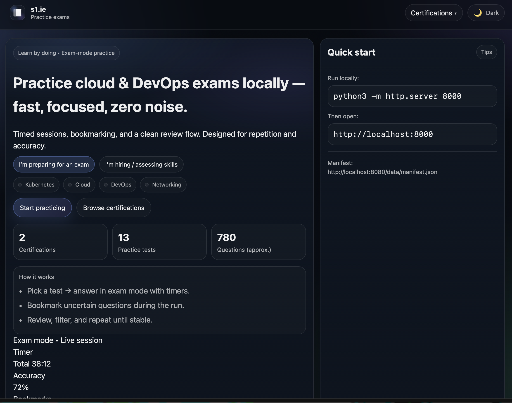
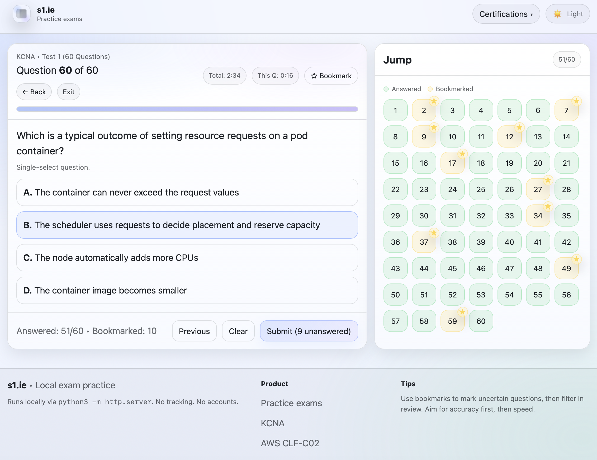
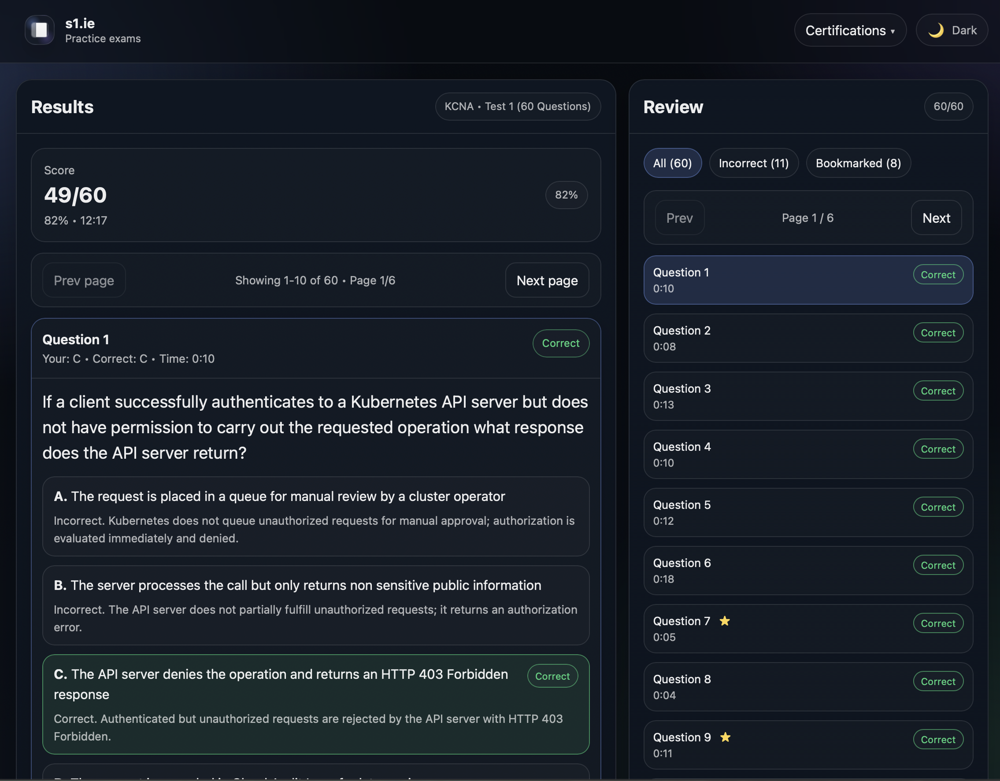

# S1.ie – DevOps-Centric Practice Exam Platform

A containerized, Kubernetes-deployed exam platform built to demonstrate real-world DevOps engineering practices.

This project showcases:

* Docker containerization
* NGINX production image
* Kubernetes (Deployment, Service, Ingress)
* Kustomize base + overlays
* Namespace isolation
* Health probes (liveness/readiness)
* GitHub Actions CI/CD
* GHCR image publishing
* Minikube local cluster deployment
* Immutable image tagging
* Rolling updates

---

# Application Screenshots

## Homepage



---

## Exam Engine



---

## Review & Results



---

# Architecture Overview

```
Developer Push
      ↓
GitHub Actions
      ↓
Docker Buildx
      ↓
Push to GHCR
      ↓
Kubernetes Deployment
      ↓
Rolling Update
      ↓
Health Probes
      ↓
Live Application
```

---

# Project Structure

```
.
├── Dockerfile
├── Makefile
├── app.js
├── index.html
├── styles.css
├── nginx.conf
├── data/
├── k8s/
│   ├── base/
│   └── overlays/
│       ├── minikube/
│       └── prod/
└── screenshots/
```

---

# Containerization

Base Image:

```
nginx:alpine
```

Features:

* Lightweight (~66MB)
* Custom nginx.conf
* /healthz endpoint
* Stateless
* Production-ready config

Build locally:

```bash
docker build -t s1ie-exams:local .
```

Run locally:

```bash
docker run -p 8080:80 s1ie-exams:local
```

---

# Kubernetes Design

Namespace:

```
s1ie
```

Deployment:

* 2 replicas
* CPU & memory requests/limits
* Liveness probe
* Readiness probe
* Rolling updates

Example probe:

```yaml
readinessProbe:
  httpGet:
    path: /healthz
    port: 80
```

Service:

* NodePort (minikube)
* ClusterIP (prod-ready)
* Ingress support

---

# Kustomize Strategy

Base:

* Environment-agnostic deployment
* Namespace
* Service
* Ingress

Overlays:

* minikube → local image + imagePullPolicy: Never
* prod → GHCR image + imagePullPolicy: Always

This separation mirrors real enterprise Kubernetes setups.

---

# CI/CD Pipeline (GitHub Actions)

Workflow:

```
.github/workflows/docker.yaml
```

On push to `main`:

1. Checkout
2. Setup QEMU
3. Setup Docker Buildx
4. Login to GHCR
5. Build & push image
6. Inject kubeconfig
7. Apply Kubernetes manifests
8. Update deployment image to commit SHA
9. Wait for rollout success

Image tagging:

```
ghcr.io/<user>/s1.ie/s1ie-exams:latest
ghcr.io/<user>/s1.ie/s1ie-exams:<commit-sha>
```

Immutable deployments via SHA-based versioning.

---

# Local Kubernetes Deployment (Minikube)

Start cluster:

```bash
minikube start
```

Point Docker to Minikube:

```bash
eval "$(minikube docker-env)"
```

Build image inside cluster:

```bash
docker build -t s1ie-exams:local .
```

Deploy:

```bash
kubectl apply -k k8s/overlays/minikube
```

Access service:

```bash
minikube service -n s1ie s1ie-exams --url
```

Health check:

```bash
curl -I "$(minikube service -n s1ie s1ie-exams --url)/healthz"
```

---

# Troubleshooting Experience Demonstrated

Resolved during development:

* ImagePullBackOff
* Docker daemon mismatch (local vs minikube)
* Namespace scoping issues
* Kustomize patch errors
* NodePort exposure
* Health probe misconfiguration

This project reflects practical debugging capability in real cluster environments.

---

# DevOps Practices Applied

* Declarative infrastructure
* Container immutability
* Namespace isolation
* Health-driven orchestration
* Resource constraints
* Environment overlays
* CI-based deployment
* SHA version pinning
* Rolling updates
* Clean separation of concerns

---

🛠 Roadmap

* Terraform-based EKS provisioning
* Helm chart packaging
* Horizontal Pod Autoscaler
* Prometheus + Grafana monitoring
* ArgoCD GitOps
* Trivy container scanning
* NetworkPolicies
* TLS via cert-manager
* Blue/Green or Canary deployment strategy

  
---

📜 License

MIT License
